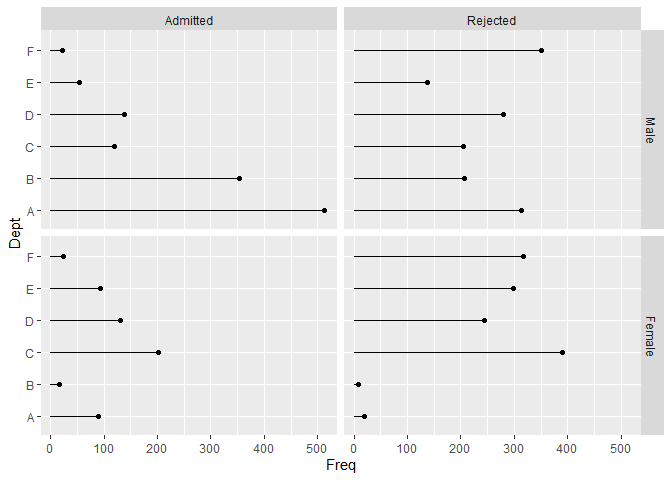

<!-- README.md is generated from README.Rmd. Please edit that file -->

# funbox

<!-- badges: start -->

<!-- badges: end -->

This is a work-in-progress package of miscellaneous functions.

## Installation

You can install the development version of funbox from
[GitHub](https://github.com/) with:

``` r
# install.packages("pak")
pak::pak("clayford/funbox")
```

## Example

At the moment, the package has one function: `dot_chart()`

``` r
library(funbox)
dot_chart(Freq ~ Dept + Gender + Admit, data = UCBAdmissions)
```


